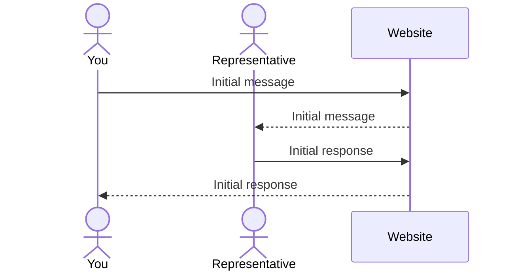

# Freedom Dance Footwear

[My Notes](notes.md)

This page is the website for my startup Freedom Dance Footwear. We specialize in creating dance shoes that fit each dancers' feet exactly. Whether you have wide, narrow, short, or long feet, we can make shoes just for you! We have an in depth set of measurements that we have you take and send to us so we know just how to make the best shoes for your feet.

> [!NOTE]
>  This is a template for your startup application. You must modify this `README.md` file for each phase of your development. You only need to fill in the section for each deliverable when that deliverable is submitted in Canvas. Without completing the section for a deliverable, the TA will not know what to look for when grading your submission. Feel free to add additional information to each deliverable description, but make sure you at least have the list of rubric items and a description of what you did for each item.

> [!NOTE]
>  If you are not familiar with Markdown then you should review the [documentation](https://docs.github.com/en/get-started/writing-on-github/getting-started-with-writing-and-formatting-on-github/basic-writing-and-formatting-syntax) before continuing.

## 🚀 Specification Deliverable

> [!NOTE]
>  Fill in this sections as the submission artifact for this deliverable. You can refer to this [example](https://github.com/webprogramming260/startup-example/blob/main/README.md) for inspiration.

For this deliverable I did the following. I checked the box `[x]` and added a description for things I completed.

- [x] Proper use of Markdown
- [x] A concise and compelling elevator pitch
- [x] Description of key features
- [x] Description of how you will use each technology
- [x] One or more rough sketches of your application. Images must be embedded in this file using Markdown image references.

### Elevator pitch

Shoes are one of the most important parts of a dancer's wardrobe, but so often they have to settle for shoes that just barely don't fit, or that break way to quickly to consistantly afford due to improper sizing. Well, my company specializes in creating shoes exactly fit to each dancer's feet. All they have to do is create a free account, fill out our measurement chart, and select the type of shoes they want and we they will have a pair of dance shoes that fit them perfectly. No more dealing with shoes that are slightly too big, or that blow out in just a month because they aren't wide enough. This will forever change how dancers buy shoes for the better.

### Design

This is a mockup of the 'homepage' of the website; it will open to a page to browse available products. If a user is not signed in, the table in the top right corner of the screen will display a button/link to log in instead.

Here's a sequence diagram to show how the chat feature will communicate with the server.

### Key features

- Browse and view measurement chart without creating a login
- Secure login over HTTPS
- Store measurements for future purchases
- View, purchase, and request new products
- Display ratings and reviews for products and processes
- Perform electronic transfers
- Chat with a representative
- View purchase history

### Technologies

I am going to use the required technologies in the following ways.

- **HTML** - Up to six HTML pages: one for account login, one to create/edit account, one page to browse and search products (main page), one to view product details and purchase it or add it to the cart, one to view and/or checkout cart, one to verify purchase details (payment method, shipping and billing address, etc.), and one to view purchase history.
- **CSS** - Styling that is compatable with different screen sizes and is pleasing to the eye.
- **React** - Display login, display product list with ratings and reviews on different pages, and account creation and editing functionality.
- **Service** - Backend services that allow for:
    - user login
    - pulling product information
    - pulling user measurements and payment information
    - verifying purchases
- **DB/Login** - Store users, products, ratings and reviews, purchase history, etc. Allows users to register and log in. Secure storage of user log in credentials and personal information.
- **WebSocket** - Chat with a representative in real time.

## 🚀 AWS deliverable

For this deliverable I did the following. I checked the box `[x]` and added a description for things I completed.

- [x] **Server deployed and accessible with custom domain name** - [My server link](https://csecs260.click).

## 🚀 HTML deliverable

For this deliverable I did the following. I checked the box `[x]` and added a description for things I completed.

- [x] **HTML pages** - I completed 7 html pages, one for each of the following purposes:
    - Login \(index.html\)
    - Browsing \(shop.html\)
    - Product Details \(details.html\)
    - Purchase Product \(purchase.html\)
    - View Cart \(cart.html\)
    - View Profile \(profile.html\)
    - Contact \(contact.html\)
    - About Company \(about.html\)
- [x] **Proper HTML element usage** - The tags I used include, but are not limited to, the following:
    - html
    - head
    - body
    - header
    - main
    - footer
    - nav
    - menu
    - form
    - table
    - p
    - span
    - input
- [x] **Links** - I included links to each page to each other page (except product details and purchase product pages, those are only available through the shop and cart pages).
- [x] **Text** - I included AI generated text for the about page, and the product details page.
- [x] **3rd party API placeholder** - I included a login page that will use a 3rd party api to allow users to log in directly with google or facebook.
- [x] **Images** - I included stock images for each 'product' my site will 'sell' and for a logo.
- [x] **Login placeholder** - I included a login placeholder on the index.html page.
- [x] **DB data placeholder** - I included many database placeholders including product information, reviews, cart contents, and purchase history.
- [x] **WebSocket placeholder** - I included a live chat feature that will serve as a WebSocket placeholder.

## 🚀 CSS deliverable

For this deliverable I did the following. I checked the box `[x]` and added a description for things I completed.

- [ ] **Header, footer, and main content body** - I did not complete this part of the deliverable.
- [ ] **Navigation elements** - I did not complete this part of the deliverable.
- [ ] **Responsive to window resizing** - I did not complete this part of the deliverable.
- [ ] **Application elements** - I did not complete this part of the deliverable.
- [ ] **Application text content** - I did not complete this part of the deliverable.
- [ ] **Application images** - I did not complete this part of the deliverable.

## 🚀 React part 1: Routing deliverable

For this deliverable I did the following. I checked the box `[x]` and added a description for things I completed.

- [ ] **Bundled using Vite** - I did not complete this part of the deliverable.
- [ ] **Components** - I did not complete this part of the deliverable.
- [ ] **Router** - I did not complete this part of the deliverable.

## 🚀 React part 2: Reactivity deliverable

For this deliverable I did the following. I checked the box `[x]` and added a description for things I completed.

- [ ] **All functionality implemented or mocked out** - I did not complete this part of the deliverable.
- [ ] **Hooks** - I did not complete this part of the deliverable.

## 🚀 Service deliverable

For this deliverable I did the following. I checked the box `[x]` and added a description for things I completed.

- [ ] **Node.js/Express HTTP service** - I did not complete this part of the deliverable.
- [ ] **Static middleware for frontend** - I did not complete this part of the deliverable.
- [ ] **Calls to third party endpoints** - I did not complete this part of the deliverable.
- [ ] **Backend service endpoints** - I did not complete this part of the deliverable.
- [ ] **Frontend calls service endpoints** - I did not complete this part of the deliverable.
- [ ] **Supports registration, login, logout, and restricted endpoint** - I did not complete this part of the deliverable.

## 🚀 DB deliverable

For this deliverable I did the following. I checked the box `[x]` and added a description for things I completed.

- [ ] **Stores data in MongoDB** - I did not complete this part of the deliverable.
- [ ] **Stores credentials in MongoDB** - I did not complete this part of the deliverable.

## 🚀 WebSocket deliverable

For this deliverable I did the following. I checked the box `[x]` and added a description for things I completed.

- [ ] **Backend listens for WebSocket connection** - I did not complete this part of the deliverable.
- [ ] **Frontend makes WebSocket connection** - I did not complete this part of the deliverable.
- [ ] **Data sent over WebSocket connection** - I did not complete this part of the deliverable.
- [ ] **WebSocket data displayed** - I did not complete this part of the deliverable.
- [ ] **Application is fully functional** - I did not complete this part of the deliverable.
