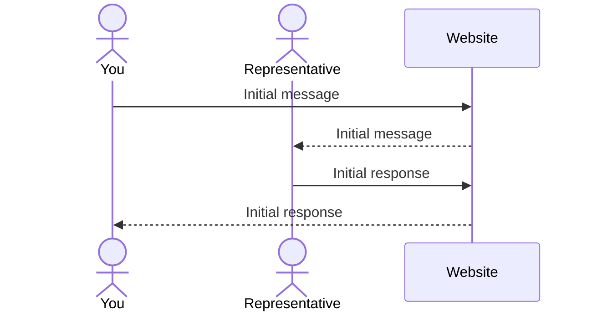

# Freedom Dance Footwear

[My Notes](notes.md)

This page is the website for my startup Freedom Dance Footwear. We specialize in creating dance shoes that fit each dancers' feet exactly. Whether you have wide, narrow, short, or long feet, we can make shoes just for you! We have an in depth set of measurements that we have you take and send to us so we know just how to make the best shoes for your feet.

> [!NOTE]
>  This is a template for your startup application. You must modify this `README.md` file for each phase of your development. You only need to fill in the section for each deliverable when that deliverable is submitted in Canvas. Without completing the section for a deliverable, the TA will not know what to look for when grading your submission. Feel free to add additional information to each deliverable description, but make sure you at least have the list of rubric items and a description of what you did for each item.

> [!NOTE]
>  If you are not familiar with Markdown then you should review the [documentation](https://docs.github.com/en/get-started/writing-on-github/getting-started-with-writing-and-formatting-on-github/basic-writing-and-formatting-syntax) before continuing.

## 🚀 Specification Deliverable

> [!NOTE]
>  Fill in this sections as the submission artifact for this deliverable. You can refer to this [example](https://github.com/webprogramming260/startup-example/blob/main/README.md) for inspiration.

For this deliverable I did the following. I checked the box `[x]` and added a description for things I completed.

- [x] Proper use of Markdown
- [x] A concise and compelling elevator pitch
- [x] Description of key features
- [x] Description of how you will use each technology
- [x] One or more rough sketches of your application. Images must be embedded in this file using Markdown image references.

### Elevator pitch

Shoes are one of the most important parts of a dancer's wardrobe, but so often they have to settle for shoes that just barely don't fit, or that break way to quickly to consistantly afford due to improper sizing. Well, my company specializes in creating shoes exactly fit to each dancer's feet. All they have to do is create a free account, fill out our measurement chart, and select the type of shoes they want and we they will have a pair of dance shoes that fit them perfectly. No more dealing with shoes that are slightly too big, or that blow out in just a month because they aren't wide enough. This will forever change how dancers buy shoes for the better.

### Design

This is a mockup of the 'homepage' of the website; it will open to a page to browse available products. If a user is not signed in, the table in the top right corner of the screen will display a button/link to log in instead.

Here's a sequence diagram to show how the chat feature will communicate with the server.

### Key features

- Browse and view measurement chart without creating a login
- Secure login over HTTPS
- Store measurements for future purchases
- View, purchase, and request new products
- Display ratings and reviews for products and processes
- Perform electronic transfers
- Chat with a representative
- View purchase history

### Technologies

I am going to use the required technologies in the following ways.

- **HTML** - Up to six HTML pages: one for account login, one to create/edit account, one page to browse and search products (main page), one to view product details and purchase it or add it to the cart, one to view and/or checkout cart, one to verify purchase details (payment method, shipping and billing address, etc.), and one to view purchase history.
- **CSS** - Styling that is compatable with different screen sizes and is pleasing to the eye.
- **React** - Display login, display product list with ratings and reviews on different pages, and account creation and editing functionality.
- **Service** - Backend services that allow for:
    - user login
    - pulling product information
    - pulling user measurements and payment information
    - verifying purchases
    - sending notifications
- **DB/Login** - Store users, products, ratings and reviews, purchase history, etc. Allows users to register and log in. Secure storage of user log in credentials and personal information.
- **WebSocket** - Chat with a representative in real time.

## 🚀 AWS deliverable

For this deliverable I did the following. I checked the box `[x]` and added a description for things I completed.

- [x] **Server deployed and accessible with custom domain name** - [My server link](https://csecs260.click).

## 🚀 HTML deliverable

For this deliverable I did the following. I checked the box `[x]` and added a description for things I completed.

- [x] **HTML pages** - I completed 7 html pages, one for each of the following purposes:
    - Login \(index.html\)
    - Browsing \(shop.html\)
    - Product Details \(details.html\)
    - Purchase Product \(purchase.html\)
    - View Cart \(cart.html\)
    - View Profile \(profile.html\)
    - Contact \(contact.html\)
    - About Company \(about.html\)
- [x] **Proper HTML element usage** - The tags I used include, but are not limited to, the following:
    - html
    - head
    - body
    - header
    - main
    - footer
    - nav
    - menu
    - form
    - table
    - p
    - span
    - input
- [x] **Links** - I included links to each page to each other page (except product details and purchase product pages, those are only available through the shop and cart pages).
- [x] **Text** - I included AI generated text for the about page, and the product details page.
- [x] **3rd party API placeholder** - I included an option to recieve email or text notifications from the website.
- [x] **Images** - I included stock images for each 'product' my site will 'sell' and for a logo.
- [x] **Login placeholder** - I included a login placeholder on the index.html page.
- [x] **DB data placeholder** - I included many database placeholders including product information, reviews, cart contents, and purchase history.
- [x] **WebSocket placeholder** - I included a live chat feature that will serve as a WebSocket placeholder.

## 🚀 CSS deliverable

For this deliverable I did the following. I checked the box `[x]` and added a description for things I completed.

- [x] **Header, footer, and main content body** - I styled the header and footer cornflowerblue with a nav bar in the header, and styled the body #F5F5DC.
- [x] **Navigation elements** - I styled the nav bar with bootstrap styles to look like tabs in a tabbed binder. They also change color when hovered over.
- [x] **Responsive to window resizing** - I styled all pages to be responsive to window resizing, most particularly to be compatible with various mobile devices.
- [x] **Application elements** - I formatted all placeholder elements to fit with the aesthetic of the site.
- [x] **Application text content** - I styled all text content to fit with the aesthetic of the site as well as their role on the page.
- [x] **Application images** - I styled all the images in the application with bootstrap classes as well as my own custom styles for page resizing.

## 🚀 React part 1: Routing deliverable

For this deliverable I did the following. I checked the box `[x]` and added a description for things I completed.

- [x] **Bundled using Vite** - I bundled my React code using Vite
- [x] **Components** - I created components for each page, as well as a component to contain my header, Routes component, and footer, so I could keep the most recent nav link highlighted when navigating to a page not on the nav bar.
- [x] **Router** - I created a Router component to display the body of each page

## 🚀 React part 2: Reactivity deliverable

For this deliverable I did the following. I checked the box `[x]` and added a description for things I completed.

- [x] **All functionality implemented or mocked out** - Every functionality is either implimented or has placeholder functionality.
- [x] **Hooks** - I use useState and useEffect hooks in many different places to define state variables, and trigger page changes when those state variables change. for example, I use a useEffect trigger to update the live chat feature each time a message is sent.

## 🚀 Service deliverable

For this deliverable I did the following. I checked the box `[x]` and added a description for things I completed.

- [x] **Node.js/Express HTTP service** - I created my HTTP service in `service/index.js`.
- [x] **Static middleware for frontend** - I have middleware functions to parse the request body into json, parse cookies, serve files in the public directory, and to verify users before reading or writing their personal data.
- [x] **Calls to third party endpoints** - I have a call to a 3rd party endpoint called Resend that allows me to send email notifications if users opt in.
- [x] **Backend service endpoints** - I have backend service endpoints for all the login functionality we went through in class, as well as creating a username and password, getting a user profile, and getting and editing the following: personal information, shipping information, billing information, and measurements.
- [x] **Frontend calls service endpoints** - My frontend calls my service endpoints on each page of the create user process, as well as when editing and displaying a user profile (as well as on each of the following pages: personal info, shipping info, billing info, measurements).
- [x] **Supports registration, login, logout, and restricted endpoint** - I implemented all of these functionalities as we went through them in class. I also included a number of other restricted endpoints for getting and editing personal info, shipping info, billing info, and measurements.

## 🚀 DB deliverable

For this deliverable I did the following. I checked the box `[x]` and added a description for things I completed.

- [x] **Stores data in MongoDB** - I store data in MongoDB for each product and each user. For the products I store their image url, name, and price. For each user I store their user name, encrypted password, a list of addresses for shipping, a list of cards for billing (not encrypted, I need to do more research about how to be able to safely unencrypt data for that which I haven't had time to do), a list of measurements, and a list representing their cart.
- [x] **Stores credentials in MongoDB** - I store a token that corresponds to a browser cookie that is created upon login and deleted upon logout. The cookie is used to determine authentication even after closing and reopening the page, so a user doesn't have to login again so long as the cookie hasn't expired.

## 🚀 WebSocket deliverable

For this deliverable I did the following. I checked the box `[x]` and added a description for things I completed.

- [x] **Backend listens for WebSocket connection** - I have backend listeners listening for messages sent from users and admins.
- [x] **Frontend makes WebSocket connection** - I have two classes that make WebSocket connections for users and admins respectively.
- [x] **Data sent over WebSocket connection** - I send message data and metadata (sender, sender status) over WebSocket connection.
- [x] **WebSocket data displayed** - I displaly WebSocket data on the Contact Us and Chat Manager page for users and admins respectively.
- [x] **Application is fully functional** - I have implimented all requirements for this class.
